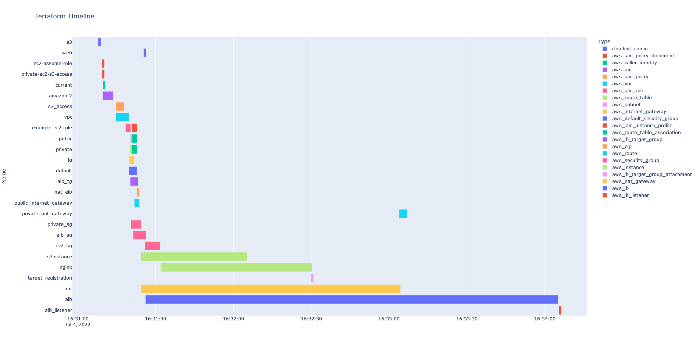

# tftimeline
Small python script for plotting a terraform apply process into a timeline to find hotspots and slow processes.




## Installation

Fastest recommended installation is with via `pipx` to install it in its own accessible but isolated virtual environment:

```sh
pipx install git+https://github.com/danielloader/tftimeline
```


## Usage

This library requires the `terraform apply` or `terraform destroy` command output to be accessible through a pipe, and the json logging flag enabled:

```sh
terraform apply -json -auto-approve | tftimeline
```

I'd recommend you save the terraform apply output to disk to manipulate without re-running the command (since you will need to destroy the stack first to trigger an apply).

```sh
terraform apply -json -auto-approve > terraform-apply.log
cat terraform-apply.log | tftimeline --output-type html --output-file timeline.html
```

Use of this tool without any flags will default to loading the timeline as a html document on localhost, and triggering a browser open to display it.

## Docker

You can also build the provided `Dockerfile` and run the application in a container:

```sh
docker build -t tftimeline:latest .
cat log.jsonl | docker run --rm -i -v $PWD:/output tftimeline:latest --output-path /output/index.html
```

Logs are still processed via stdin, so the `-i` flag is mandatory when running this container. 
Volume mount is needed to write out the exported graph.